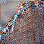
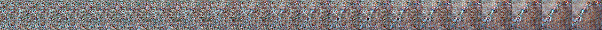

# diffusion-artifact-estimator

(Anti) Proof of Concept for the task of artifact estimation on early generation steps of reverse diffusion process of image generation.

*Spoiler*: The results are pretty bad, there are several reasons for it, which will be named in the end of this file. But mainly, it's because the training sample was too small.

### Approach

This project was heavily inspired by [aesthetic-scorer](https://github.com/kenjiqq/aesthetics-scorer) by kenjiqq

The idea is to train an MLP regression network on finetuned CLIP embeddings finetuned on latent representations of images in their generation progress. Due to the nature of latent space of Stable Diffusion, we can (sort of) try to represent these embeddings as a small noisy image with simple matrix multiplication. 

The dataset that I was using is diffusiondb, which contains over 14M images, with their generation parameters and a different dataset AI-Horde with ratings for images in former dataset. SInce images in the dataset are fully generated and are represented in Image space, one of the goals was to encode all of the images (in training subset) in VAE latent space, and apply forward noising with scheduler to get noisy latents, and then approximate them with already mentioned matrix multiplication. It looks something like this:

For the sake of testing the hypothesis I only trained and tested on just half noisy sample (e.g. 10th step out of 20). Then, with constructed dataset, we need to obtain embeddings to train MLP. But there's a catch. Using pretrained CLIP to obtain embeddings of low-resolution noisy images would lead to low quality noisy embeddings. For that matter, I fine-tuned a CLIP model on dataset of noisy samples using open_clip library. [Here&#39;s the W&amp;B training log ](https://api.wandb.ai/links/stamps-labs/ptzem7g6). Now, on trained embeddings, we could train a simple MLP that would yield a continious value in range [0, 5] based on how much artifacts there are in the image. [Here&#39;s its W&amp;B log](https://api.wandb.ai/links/stamps-labs/we6ugqc4). It was found that my network usually returns the mean value of the range (2.5) majority of the time, therefore not leading to any good performance, but it must be mentioned that my training set only consisted of 10k samples.

### Possible Improvements

* First and foremost, train models on atleast 1M samples to get somewhat good results.
* Reconsider the whole approach and instead of training and running inference on approximated latent space, use, for example, [tiny VAE](https://github.com/madebyollin/taesd), to operate on image space.
* Instead of training regression MLP for predicting the value, we could further fine-tuned our CLIP for downstream classification task with something like [wise-ft](https://github.com/mlfoundations/wise-ft).
* When constructing dataset, use different schedulers for forward diffusion process and use different timesteps at which noise would be added.
* Try adding random noise on each step of forward diffusion, contrary to what reverse diffusion does.
* When training CLIP use greater batch size, since loss is pretty much calculated within the batch and greater batch size would converge the loss faster.
* Also one of the cool ideas is that we could use some sort of Mixture of experts which operate on different timesteps and use their predictions altogether. But this is significantly more computationally expensive.
* Calculate some sort of Cumulative distribution at each step, similarly to PALBERT paper, where authors can exit transformer encoders early when sum of all confidence levels on each transformer block exceeds certain threshold. We could adapt this idea and combine it with MoE to calculate how likely artifacts are to appear on final step given current step and add them together.
